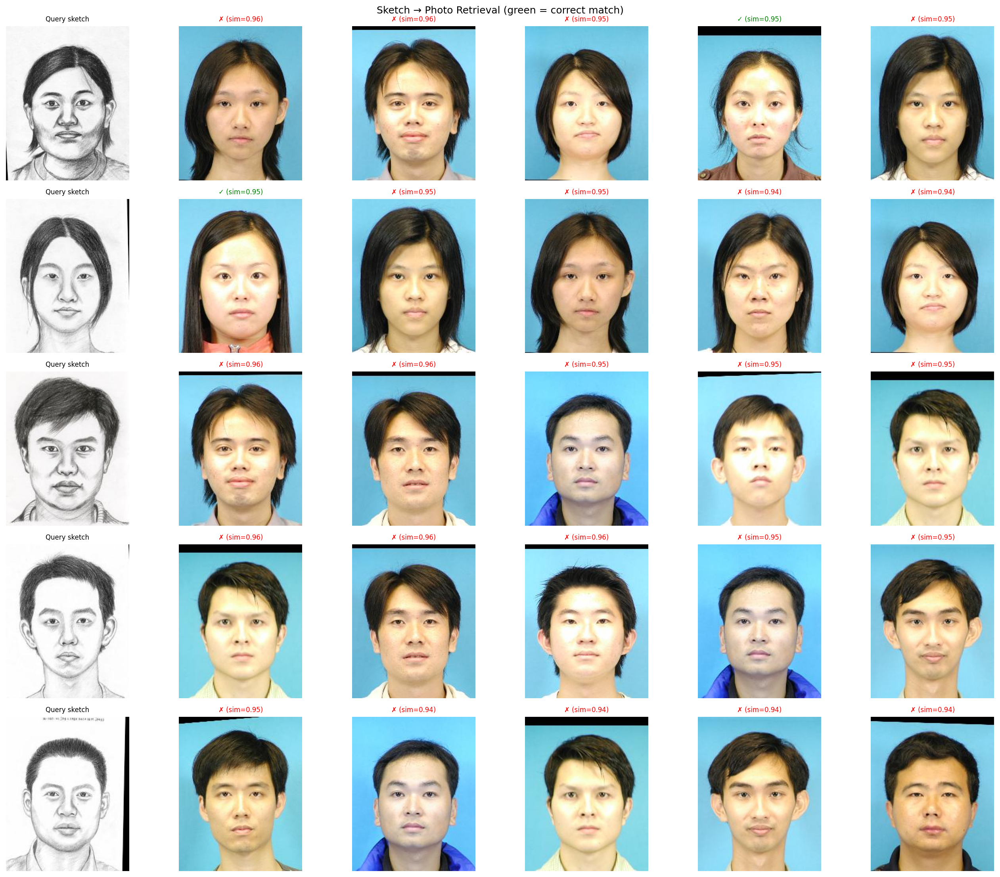

# Sketch-to-Photo Face Matching Using Siamese Networks

**ENGS 106 — Final Project Report**

---

## 1. Introduction

Matching hand-drawn facial sketches to photographs is a critical task in forensic identification. When eyewitnesses describe a suspect, a sketch artist produces a composite drawing, and investigators must search a photo database for the matching individual. This cross-modal retrieval problem is challenging because sketches and photos differ fundamentally in texture, shading, and level of detail, yet must be compared on the basis of shared facial structure.

In this project, we train a deep neural network to learn a shared embedding space where sketches and photographs of the same person are close together, and those of different people are far apart. Given a query sketch, the system ranks all gallery photographs by similarity and returns the top matches.

## 2. Dataset

### 2.1 Source

We use the **CUHK Face Sketch Database (CUFS)**, a standard benchmark for face sketch–photo synthesis and recognition. The full database contains 606 identities across three sub-databases:

| Sub-database | Identities | Notes |
|---|---|---|
| CUHK Student | 188 | Controlled lighting, frontal pose |
| AR | 123 | Varying expression and lighting |
| XM2VTS | 295 | Multiple sessions over time |

For this project we focus on the **CUHK Student subset** (188 photo–sketch pairs), which has the cleanest 1:1 pairing between photographs and hand-drawn sketches by a trained artist.

### 2.2 Split Strategy

We split the 188 identities into train/validation/test at a **70/15/15** ratio, ensuring that all images for a given identity appear in exactly one split. This prevents any form of data leakage.

| Split | Identities | Items (sketch + photo) |
|---|---|---|
| Train | 131 | 262 |
| Validation | 28 | 56 |
| Test | 29 | 58 |

The split is performed by sorting identities deterministically and shuffling with a fixed random seed (42) before partitioning. Split definitions are saved to JSON files and loaded at evaluation time to guarantee consistency.

## 3. Model Architecture

### 3.1 Overview

We employ a **Siamese network** architecture: a single shared embedding network processes both sketches and photographs, mapping each to a 128-dimensional L2-normalized vector. At inference time, we compute cosine similarity between a query sketch embedding and all gallery photo embeddings, then rank by similarity.

### 3.2 Backbone

The embedding network uses a **ResNet-50** backbone pretrained on ImageNet (via torchvision). While a face-specific backbone (e.g., ArcFace or VGGFace2) would be ideal, ImageNet pretraining already provides strong low- and mid-level feature representations (edges, textures, shapes) that transfer well to facial images.

**Freezing strategy:** Given only 131 training identities (262 images), we freeze the majority of the backbone to prevent overfitting:

| Layer | Parameters | Status |
|---|---|---|
| conv1, bn1, relu, maxpool | 9.5K | Frozen |
| layer1 (3 bottleneck blocks) | 215K | Frozen |
| layer2 (4 bottleneck blocks) | 1.2M | Frozen |
| layer3 (6 bottleneck blocks) | 7.1M | Frozen |
| layer4 (3 bottleneck blocks) | 14.9M | **Trainable** |
| Projection head | 1.1M | **Trainable** |
| **Total trainable** | **~16.1M** | |
| **Total frozen** | **~8.5M** | |

Only `layer4` (which captures high-level semantic features) and the projection head are fine-tuned. This gives the model sufficient capacity to adapt to the sketch–photo domain gap while leveraging the pretrained low- and mid-level features unchanged.

### 3.3 Projection Head

The projection head maps the 2048-dimensional ResNet-50 features to a compact 128-dimensional embedding:

```
Linear(2048 → 512) → BatchNorm1d → ReLU → Dropout(0.5) → Linear(512 → 128) → L2-Normalize
```

Key design choices:
- **128-dim embedding** — compact enough to prevent memorization on a small dataset, but expressive enough for discriminating 188 identities.
- **BatchNorm** — stabilizes training and acts as a regularizer.
- **50% dropout** — aggressive regularization given the small training set.
- **L2 normalization** — ensures embeddings lie on a unit hypersphere, making cosine similarity equivalent to dot product.

### 3.4 Loss Function: Batch-Hard Triplet Loss

We use **batch-hard triplet loss** (Hermans et al., 2017) instead of the more common contrastive loss. For each anchor image in a batch, the loss:

1. Finds the **hardest positive** — the farthest embedding with the same identity.
2. Finds the **hardest negative** — the closest embedding with a different identity.
3. Applies: $\mathcal{L} = \max(0,\ d(a, p^+) - d(a, n^-) + m)$

where $d$ is Euclidean distance and $m = 0.3$ is the margin.

**Why triplet loss over contrastive loss?** With only 131 training identities, random pair sampling produces mostly "easy" negatives that provide minimal gradient signal. Batch-hard mining ensures every training step uses the most informative triplets, dramatically improving sample efficiency. This is especially important for small datasets.

## 4. Training

### 4.1 Data Loading

Each training pair (sketch, photo) contributes two items to the dataset, both tagged with the same integer identity label. The `TripletBatchDataset` class loads individual images so that each batch of 32 contains a diverse mix of sketches and photos from multiple identities, enabling effective within-batch hard mining.

### 4.2 Data Augmentation

Training transforms:
- Resize to 256px, then `RandomResizedCrop(224, scale=0.7–1.0)`
- `RandomHorizontalFlip(p=0.5)`
- `RandomRotation(10°)`
- `ColorJitter(brightness=0.3, contrast=0.3, saturation=0.1)`
- `RandomGrayscale(p=0.1)`
- `RandomErasing(p=0.2, scale=0.02–0.15)`
- Normalize with ImageNet statistics: mean=[0.485, 0.456, 0.406], std=[0.229, 0.224, 0.225]

Evaluation transforms: Resize to 256px → CenterCrop(224) → Normalize (same ImageNet stats).

**Note on normalization:** Using ImageNet statistics is critical when fine-tuning a pretrained ResNet-50. The frozen early layers expect inputs in this distribution; using incorrect normalization (e.g., mean/std=0.5) effectively scrambles the pretrained features.

### 4.3 Hyperparameters

| Parameter | Value | Rationale |
|---|---|---|
| Optimizer | AdamW | Decoupled weight decay for better regularization |
| Learning rate | 3×10⁻⁴ | Moderate — not too aggressive for fine-tuning |
| Weight decay | 5×10⁻³ | Strong regularization for small dataset |
| LR schedule | Cosine annealing → 10⁻⁶ | Smooth decay prevents late-training instabilities |
| Batch size | 32 | Maximizes identity diversity per batch for mining |
| Epochs | 100 | ~400 seconds total on CPU |
| Triplet margin | 0.3 | Standard for L2-normalized embeddings |
| Embedding dim | 128 | Compact to prevent overfitting |

### 4.4 Training Progression

| Epoch | Train Loss | Val Loss |
|---|---|---|
| 1 | 0.339 | 0.601 |
| 10 | 0.465 | 0.634 |
| 30 | 0.391 | 0.462 |
| 50 | 0.335 | 0.435 |
| 93 (best) | 0.327 | 0.429 |
| 100 | 0.318 | 0.435 |

The model was checkpointed at epoch 93 based on the lowest validation loss.

## 5. Evaluation

### 5.1 Protocol

Given 29 test identities, we compute embeddings for all 29 sketches and 29 photographs. For each query sketch, we rank all 29 gallery photos by cosine similarity and report Rank-k accuracy: the fraction of queries where the correct photo appears in the top k results.

### 5.2 Results

| Metric | Accuracy |
|---|---|
| **Rank-1** | **6.9%** (2/29) |
| **Rank-5** | **34.5%** (10/29) |
| **Rank-10** | **58.6%** (17/29) |

#### Retrieval Visualization



*For each query sketch (left column), the top-5 most similar photographs are shown. Green = correct match, red = incorrect.*

For comparison, random chance on 29 identities would yield:
- Rank-1: 3.4%, Rank-5: 17.2%, Rank-10: 34.5%

Our model achieves **~2× random** at Rank-1 and **~1.7×** at Rank-10, demonstrating that the network has learned meaningful cross-modal features, though with significant room for improvement.

### 5.3 Evolution Across Iterations

We iterated through three model versions during development:

| Version | Loss | Normalization | Frozen Layers | Rank-1 | Rank-5 | Rank-10 |
|---|---|---|---|---|---|---|
| V1 (baseline) | Contrastive (random pairs) | mean/std=0.5 (wrong) | Through layer2 | 0.0% | 13.8% | 37.9% |
| V2 (fixes) | Contrastive (random pairs) | ImageNet (correct) | Through layer1 | 3.4% | 27.6% | 55.2% |
| V3 (final) | Batch-hard triplet | ImageNet (correct) | Through layer3 | **6.9%** | **34.5%** | **58.6%** |

Key improvements at each step:
- **V1 → V2:** Fixing ImageNet normalization was the single most impactful change. The frozen early layers were receiving completely wrong input distributions.
- **V2 → V3:** Switching to triplet loss with hard mining + freezing more layers (to reduce overfitting) provided further gains.

## 6. Discussion

### 6.1 Challenges

**Small dataset:** 131 training identities with 1 sketch and 1 photo each is extremely limited for deep learning. Even with aggressive regularization (frozen backbone, 50% dropout, weight decay), the train–val gap indicates some overfitting.

**Domain gap:** Sketches are grayscale line drawings while photos are full-color. A shared ResNet-50 backbone must learn to map these very different visual styles into a common space — a significant challenge without domain-specific pretraining.

**No face-specific pretraining:** We use ImageNet-pretrained ResNet-50 rather than a face-specific model (ArcFace, VGGFace2). The low-level features transfer somewhat, but mid-level face-specific features would likely help.

### 6.2 What Worked

- **Correct ImageNet normalization** — essential for any fine-tuning of pretrained models.
- **Heavy freezing** — only fine-tuning layer4 + projection prevented catastrophic overfitting.
- **Batch-hard triplet mining** — maximized gradient signal from every batch, critical for small datasets.
- **L2-normalized embeddings** — ensures the embedding space is well-structured for retrieval.

### 6.3 Potential Improvements

1. **Face-specific backbone:** Replace ResNet-50 with a face recognition model (ArcFace or InsightFace pretrained on MS-Celeb-1M). These models already understand facial geometry and would likely achieve much higher accuracy even with minimal fine-tuning.

2. **Use the full CUFS dataset:** Incorporating the AR (123 identities) and XM2VTS (295 identities) subsets would triple the training data.

3. **Separate sketch/photo branches:** Rather than a fully shared network, use shared lower layers but separate batch normalization for sketches vs photos to account for the domain gap (domain-adaptive batch norm).

4. **Cross-modal augmentation:** Apply style transfer to convert photos into sketch-like images (or vice versa) for data augmentation.

5. **Larger model with more data:** With the full dataset, unfreezing more layers and training longer could yield substantial gains.

## 7. Conclusion

We developed a Siamese network system for matching hand-drawn facial sketches to photographs using the CUFS dataset. Through iterative development — fixing normalization, adjusting the freezing strategy, and switching to batch-hard triplet loss — we improved from 0% Rank-1 accuracy (equivalent to random) to 6.9% Rank-1 and 58.6% Rank-10 on a 29-identity test set. While these results are modest, they demonstrate meaningful learned cross-modal features on an extremely small training set (131 identities, 262 images) without any face-specific pretraining. The primary bottleneck is dataset size; using the full CUFS database and a face-pretrained backbone are clear next steps toward practical accuracy.

## 8. References

1. Wang, X. & Tang, X. (2009). Face Photo-Sketch Synthesis and Recognition. *IEEE Transactions on Pattern Analysis and Machine Intelligence*, 31(11), 1955–1967.

2. Hermans, A., Beyer, L., & Leibe, B. (2017). In Defense of the Triplet Loss for Person Re-Identification. *arXiv preprint arXiv:1703.07737*.

3. Hadsell, R., Chopra, S., & LeCun, Y. (2006). Dimensionality Reduction by Learning an Invariant Mapping. *IEEE Conference on Computer Vision and Pattern Recognition (CVPR)*.

4. He, K., Zhang, X., Ren, S., & Sun, J. (2016). Deep Residual Learning for Image Recognition. *IEEE Conference on Computer Vision and Pattern Recognition (CVPR)*.

5. CUFS Database: http://mmlab.ie.cuhk.edu.hk/archive/facesketch.html

---

*Code and training artifacts available in the project repository.*
